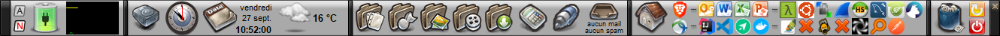
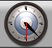
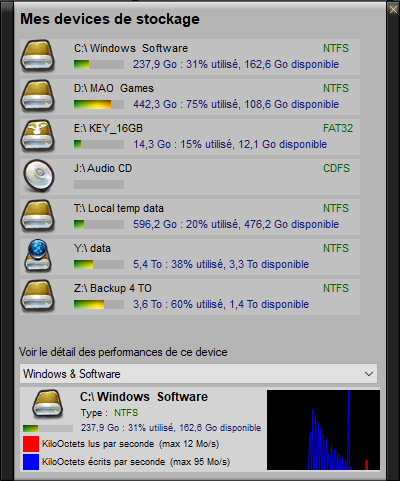
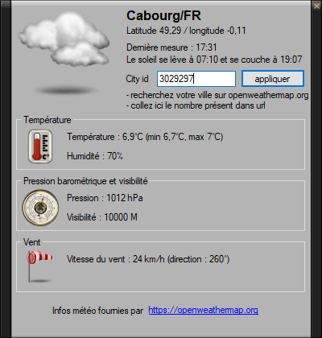
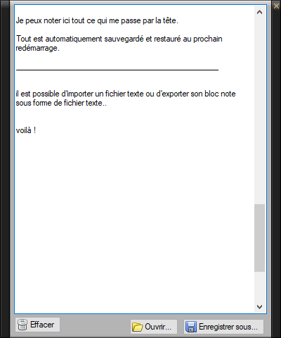
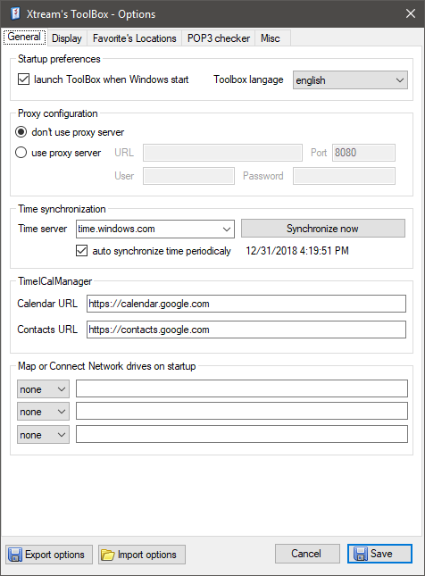
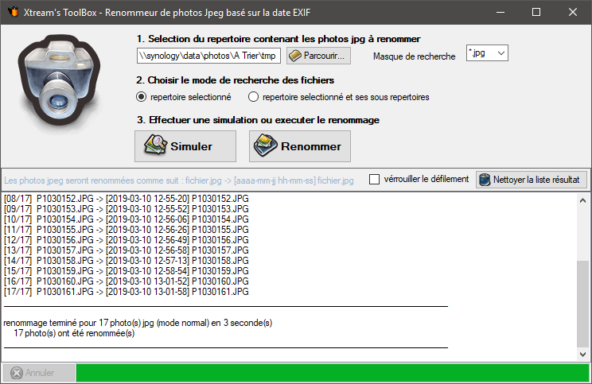

# Xtream's ToolBox
> Barre d’outils multifonctions personnalisable

<!-- @import "[TOC]" {cmd="toc" depthFrom=2 depthTo=6 orderedList=false} -->

<!-- code_chunk_output -->

* [Information Générales](#information-générales)
* [Les sensors](#les-sensors)
	* [KeyStatus](#keystatus)
	* [PowerStatus](#powerstatus)
	* [SystemInfos](#systeminfos)
	* [AnalogClock](#analogclock)
	* [Storage](#storage)
	* [TimeManager](#timemanager)
	* [Weather](#weather)
	* [Inbox](#inbox)
	* [Calc](#calc)
	* [Notepad](#notepad)
	* [MyComputer](#mycomputer)
	* [FavoriteLocations](#favoritelocations)
	* [QuickLauncher](#quicklauncher)
	* [RecycleBin](#recyclebin)
	* [ShutdownManager](#shutdownmanager)
	* [Spacer](#spacer)
* [Le paramétrage](#le-paramétrage)
* [Renommeur de photo JPEG basé sur la date EXIF](#renommeur-de-photo-jpeg-basé-sur-la-date-exif)

<!-- /code_chunk_output -->

## Information Générales

- Langage de dévelopement : C#
- Auteur : Fabrice Deshayes aka Xtream
- Dll/packages utilisées :
    - [C2DPushGraph by Stuart Konen](https://www.codeproject.com/articles/16634//Articles/16634/C2DPushGraph-A-Push-Graph-Control-2) (graph mode of System Info and Storage Sensor)
	- [Global mouse key hook by gmamaladze](https://github.com/gmamaladze/globalmousekeyhook)
	- [Newtonsoft by JamesNK](https://github.com/JamesNK/Newtonsoft.Json)
    - Google Data API (calendar)
- Icons :
    - IconBuffet studio
    - [Refreshcl by tpdk](https://www.deviantart.com/tpdkcasimir/art/Refresh-CL-Icons-Pack-25565201)
    - [G.A.N.T. by mattahan](https://www.deviantart.com/mattahan/art/G-A-N-T-3035321)
    - [Weather iconset by Wojciech Grzanka](http://www.softicons.com/web-icons/weather-icons-by-wojciech-grzanka)

Xtream's Toolbox est une barre d'outils multifonction personnalisable. Elle est composée d’un container (appelé aussi « toolbox ») qui héberge un ou plusieurs « sensor ». Chaque sensor a une fonction particulière et peut être paramétrable. Il est possible d’ajouter ou de supprimer des sensors et de définir leurs positions les uns par rapport aux autres. Ce logiciel a été réalisé pour mes besoins personnels (principalement en 2006) et évolue depuis par petite touches

Les sensors disponibles sont (de gauche à droite sur le screenshot) :
- KeyStatus
- PowerStatus
- SystemInfos
- Spacer
- Storage
- AnalogClock
- TimeManager
- Weather
- Inbox
- Calc
- Notepad
- MyComputer
- FavoriteLocations
- QuickLauncher
- RecycleBin
- ShutdownManager
- Spacer

La toolbox contient également des fonctions annexes, accessible depuis l’icône présent dans la barre de tâche. Outre les fonctions classiques « a propos », « paramétrage » et « quitter », vous y trouverez également un renommeur de photos Jpeg basé sur la date EXIF (date de prise du cliché positionnée par l’appareil utilisé pour prendre la photo).

## Les sensors

### KeyStatus

Ce sensor permet d’afficher le status des touches verrouillage majuscule (capslock) et vérouillage numérique (numlock).

### PowerStatus

Ce sensor permet d’afficher le mode d’alimentation du PC ainsi que le niveau de charge de la batterie.

Un clic avec le bouton gauche de la souris ouvre le panneau de configuration de l’alimentation du PC.

### SystemInfos

Permet d’afficher le taux d’utilisation du processeur, de la mémoire et du réseau selon 2 modes : vumètres ou graphique 

Un clic avec le bouton gauche de la souris permet d’ouvrir le panneau d’extension qui contient beaucoup d'information sur l'ordinateur.

Un clic avec le bouton droit de la souris affiche un menu contextuel qui permet de basculer entre le mode graphique et vumètres. En mode graphique, un clic droit permet d’activer ou de désactiver des lignes sur le graphique 

Il est possible de sélectionner les interfaces réseau et de définir les débits max dans les options.

### AnalogClock

Ce sensor permet d’afficher l’heure courante sous forme d’horloge « analogique » (avec des aiguilles)

L’heure du PC peut être mise à l’heure de manière automatique via l’utilisation du protocole NTP et d’un serveur de temps sur Internet. Ce paramétrage s’effectue sur le premier onglet des paramètres de la toolbox.

### Storage

Ce sensor permet de voir en un clin d’œil l’espace disque occupé et disponible sur les partitions des disques dur du PC. Il permet également d’obtenir des informations détaillé sur une lecteur comme le type de partition (FAT16 / FAT32 / NTFS…) ainsi qu’un graphique du débit en lecture et écriture.

Un clic avec le bouton gauche de la souris permet d’ouvrir le panneau d’extension.

### TimeManager

Ce sensor affiche la date et l’heure courante. Via un clic sur l’icône, on peut accéder à un calendrier sommaire qui affiches les événements de son calendrier gmail (si on a saisi son login / mdp gmail dans les options) -> fonction expérimentale qui eut fonctionnée mais qui ne marche plus très bien.

### Weather

Ce sensor affiche le temps actuel. Un clic gauche fait apparaître le panneau d’extension avec plus d’information (et le choix du lieu).

### Inbox

Ce sensor affiche le nombre de mails disponible sur une ou plusieurs BAL de type POP. Il est possible de configurer les BAL dans les paramètres, ainsi que quelques règles sommaires pour la détection de spam.

### Calc

Ce sensor est un raccourci permettant de lancer la calculatrice fournie avec Windows.

### Notepad

Ce sensor est un bloc note. Un clic sur le bouton gauche affiche/cache le bloc note, un clic sur le bouton droit permet de lancer son éditeur de texte favoris (configurable dans les paramètres).

### MyComputer

Ce sensor est un raccourci permettant de lancer l'explorateur de fichiers. Un clic droit permettant également d'afficher un menu contextuel pour accéder rapidement à certaines fonctionnalités de Windows.

### FavoriteLocations

Ce sensor permet d'accéder rapidement à un emplacement sur le disque dur ou à un site web. C'est donc une sorte de mini bookmark (les répertoires et les sites web peuvent être renseigné dans les paramètres)

### QuickLauncher

Ce sensor vous permet de dragn'n droper vos raccourcis afin de les avoir toujours sous la main. un clic droit sur un favoris permet de l'éditer ou le supprimer. On peut également le déplacer via un drag'n drop. Une croix rouge s'affiche si le fichier n'est plus disponible à l'endroit indiqué.

### RecycleBin

Ce sensor permet de vider la corbeille (clic droit) ou d'avoir accès à son contenu (clic gauche). Il est possible de désactiver la confirmation dans les paramètres.

### ShutdownManager

Ce sensor permet d'avoir des icones d'accès rapide à deux des fonctionnalités suivantes : verrouiller/clore la session/changer d'utilisateur/redémarrer/veille prolongée/arrêter l'ordinateur. Voir les paramètres pour choisi quelle action choisir.

Il est également possible, via un clic droit sur les icones, d'ouvrir le panneau d'extension afin de planifier un arrêt.

### Spacer

Ce sensor un peu spécial sert juste à séparer comme bon vous semble votre toolbox. Vous pouvez en placer autant que vous voulez.

## Le paramétrage

Les screenshots parlant d'eux même, je vous laisse découvrir :-)

## Renommeur de photo JPEG basé sur la date EXIF

Cet outils permet de renommer les photos jpeg en intégrant un timestamp qui permet que l'ordre alphabétique des noms des fichiers sera l'ordre chronologique de date/heure de la prise de vue.

